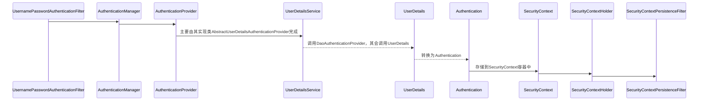
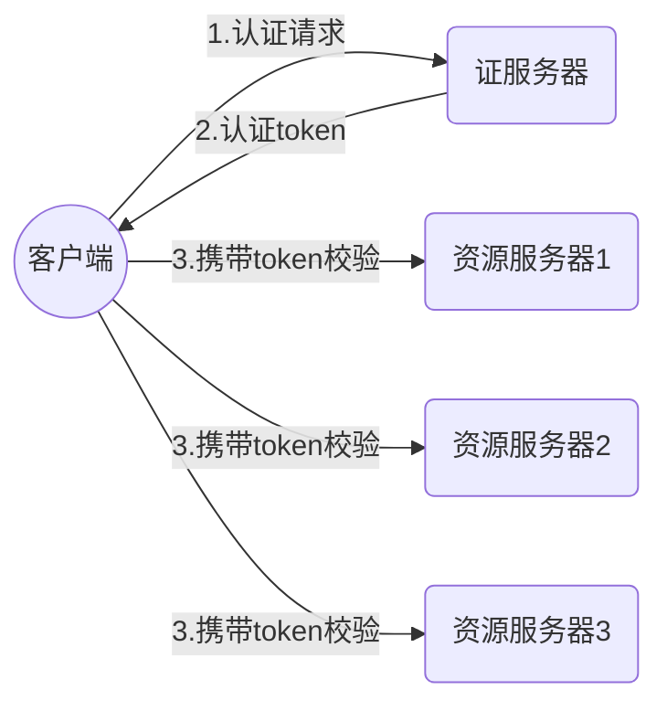

# Spring Security

spring security主要是为了认证和授权，即`authentication`/`authorization` 。无论你选择Apache Shiro 或者 Spring Security 都需要熟悉这两个概念。其实简单来说认证（authentication）就是为了证明`你是谁`，比如你输入账号密码证明你是用户名为2333的用户。而授权（authorization）是通过认证后的用户所绑定的角色等凭证来证明`你可以做什么` 。打一个现实中的例子。十一长假大家远行都要乘坐交通工具，现在坐车实名制，也就是说你坐车需要两件东西：`身份证`和`车票` 。身份证是为了证明你确实是你，这就是 `authentication`；而车票是为了证明你张三确实买了票可以上车，这就是 `authorization`。这个例子从另一方面也证明了。如果只有认证没有授权，认证就没有意义。如果没有认证，授权就无法赋予真正的可信任的用户。两者是同时存在的。

通过**过滤器链**的方式实现，经过一个过滤器，通过后执行下一个过滤器，知道所有过滤器通过。

在ssm中需要在web.xml中添加`DelegatingFilterChainProxy`过滤器，并指定过滤器的名字为`springSecurityFilterChain`，`DelegatingFilterChainProxy`过滤器的作用是找到名为`springSecurityFilterChain`的过滤器，然后让该过滤器执行其过滤内容。

在使用shiro时，也要指定`DelegatingFilterChainProxy`的名字为`shiroFilter`的过滤器执行。

springboot项目中，只要引入spring-security的启动器即可。

### RBAC模型

RBAC 是基于角色的访问控制（Role-Based Access Control ）的简称。在 RBAC 中，权限与角色相关联，用户通过成为适当角色的成员而得到这些角色的权限。这就极大地简化了权限的管理。这样管理都是层级相互依赖的，权限赋予给角色，而把角色又赋予用户，这样的权限设计很清楚，管理起来很方便。当你拥有某个角色以后，你自然继承了该角色的所有功能。对你的一些操作限制不需要直接与你进行沟通，只需要操作你拥有的角色。比如你在公司既是一个java程序员又是一个前端程序员，那么你不但要当sqlboy还要当页面仔。如果有一天经理说了前端负责测试工作，好了你又承担了测试任务。

### 过滤器链

1. ==org.springframework.security.web.context.SecurityContextPersistenceFilter==

> 首当其冲的一个过滤器，作用之重要，自不必多言。
> SecurityContextPersistenceFilter主要是使用SecurityContextRepository在session中保存或更新一个SecurityContext，并将SecurityContext给以后的过滤器使用，来为后续filter建立所需的上下文。
> SecurityContext中存储了当前用户的认证以及权限信息。

2. org.springframework.security.web.context.request.async.WebAsyncManagerIntegrationFilter

> 此过滤器用于集成SecurityContext到Spring异步执行机制中的WebAsyncManager

3. org.springframework.security.web.header.HeaderWriterFilter

> 向请求的Header中添加相应的信息，可在http标签内部使用security:headers来控制

4. orgspringframework.security.web.csrf CsrfFilter 

> csrf又称跨域请求伪造，SpringSecurity会对所有post请求验证是否包含系统生成的csrf的token信息，如果不包含，则报错。起到防止csrf攻击的效果。

5. org.springframework.security.web.authentication.logout.LogoutFilter

> 退出账号的过滤器，匹配路径为/logout

6.==org.springframework.security.web.authentication.UsernamePasswordAuthenticationFilter==

> 认证(点击登录后进行验证)操作过滤器，默认匹配URL为/login且必须为POST请求。

7. org.springframework.security.web.authentication.ui.DefaultLoginPagerGeneratingFilter

>如果没有在配置文件中指定认证(登录)页面，则由该过滤器生成一个默认登录页面

8. org.springframework.security.web.authentication.ui.DefaultLogoutPageGeneratingFilter

> 由此过滤器可以生产一个默认的退出登录页面

9. org.springframework.security，web.authentication.www.BasicAuthenticationFilter

> 此过滤器会自动解析HTTP请求中头部名字为Authentication，且以Basic开头的头信息。

10. org.springframework.security.web.savedrequest.RequestCacheAwareFilter

> 通过HttpSessionRequestCache内部维护了一个RequestCache，用于缓存HttpServletRequest

11. org.springframework.security.web.servletapi.SecurityContextHolderAwareRequestFilter

> 针对ServletRequest进行了一次包装，使得request具有更加丰富的APl

12. org.springframework.security.web.authentication.AnonymousAuthenticationFilter

> 当SecurityContextHolder中认证信息为空，则会创建一个匿名用户存入到SecurityContextHolder中。spring security为了兼容未登录的访问，也走了一套认证流程，只不过是一个匿名的身份。
>
> 就是未经登录也可以访问的资源路径

13. org.springframework.security.web.session.SessionManagementFilter SecurityContextRepositor

> 限制同一用户开启多个会话的数量

14. org.springframework.security.web.access.ExceptionTranslationFilter

> 异常转换过滤器位于整个springSecurityFilterChain的后方，用来转换整个链路中出现的异常

15. ==org.springframework.security.web.access.intercept.FilterSecuritylnterceptor==

> 获取所配置资源访问的授权信息，根据SecurityContextHolder中存储的用户信息来决定其是否有权限。

| Alias                        | Filter Class                                        | Namespace Element or Attribute         |
| ---------------------------- | --------------------------------------------------- | -------------------------------------- |
| CHANNEL_FILTER               | ChannelProcessingFilter                             | http/intercept-url@requires-channel    |
| SECURITY_CONTEXT_FILTER      | ==**SecurityContextPersistenceFilter**==            | http                                   |
| CONCURRENT_SESSION_FILTER    | ConcurrentSessionFilter                             | session-management/concurrency-control |
| HEADERS_FILTER               | HeaderWriterFilter                                  | http/headers                           |
| CSRF_FILTER                  | ==**CsrfFilter**==                                  | http/csrf                              |
| LOGOUT_FILTER                | ==**LogoutFilter**==                                | http/logout                            |
| X509_FILTER                  | X509AuthenticationFilter                            | http/x509                              |
| PRE_AUTH_FILTER              | AbstractPreAuthenticatedProcessingFilter Subclasses | N/A                                    |
| CAS_FILTER                   | CasAuthenticationFilter                             | N/A                                    |
| FORM_LOGIN_FILTER            | **==UsernamePasswordAuthenticationFilter==**        | http/form-login                        |
| BASIC_AUTH_FILTER            | BasicAuthenticationFilter                           | http/http-basic                        |
| SERVLET_API_SUPPORT_FILTER   | SecurityContextHolderAwareRequestFilter             | http/@servlet-api-provision            |
| JAAS_API_SUPPORT_FILTER      | JaasApiIntegrationFilter                            | http/@jaas-api-provision               |
| REMEMBER_ME_FILTER           | RememberMeAuthenticationFilter                      | http/remember-me                       |
| ANONYMOUS_FILTER             | AnonymousAuthenticationFilter                       | http/anonymous                         |
| SESSION_MANAGEMENT_FILTER    | SessionManagementFilter                             | session-management                     |
| EXCEPTION_TRANSLATION_FILTER | ExceptionTranslationFilter                          | http                                   |
| FILTER_SECURITY_INTERCEPTOR  | ==**FilterSecurityInterceptor**==                   | http                                   |
| SWITCH_USER_FILTER           | SwitchUserFilter                                    | N/A                                    |


### 认证授权

即是只有一个服务器用于访问，所有用户都在同一个服务器进行授权认证。认证信息可以保存到session中。

##### 配置

security默认访问任何资源都需要进行认证。

配置SecurityConfig类，继承` WebSecurityConfigurerAdapter`类。

开启security，`EnableWebSecurity`

```java
@Configuration
@EnableWebSecurity
public class SecurityConfig extends WebSecurityConfigurerAdapter {
    
    // 注入到ioc容器，用于加密密码
    @Bean
    public BCryptPasswordEncoder passwordEncoder(){
        return new BCryptPasswordEncoder();
    }
    
    /**
    重写此方法用于自定义认证信息
    自定义不需要拦截的资源
    自定义登录及退出
    自定义csrf
    **/
    @override
    public void configure(HttpSecurity http) throws Exception {
        http.authorizeRequests()
            //静态资源的释放也可以通过
            .antMatchers("/css/**","/js/**") //添加匹配路径
            .permitAll()//全部允许，即不拦截
            .antMatchers("/admin/**")//admin下的资源
            /* hasAuthority(“admins")，要拥有指定权限才能访问,权限集合在UserDetailsService
            中获得，hasAnyAuthority()多个权限中的任一个，与hasRole()功能类似
            用于后面FilterSecurityInterceptor进行鉴权
            */
            .hasAnyRole("admin")//只有拥有admin角色的人可以访问
            .anyRequest()//除去允许访问发的
            .authenticated()//其他路径都需要认证后访问
            .and()
            .formLogin	//表单登录认证
            .loginPage("/1ogin.html")	//登录页面，不指定会使用spring自动生成的
            .1oginProcessingUr1("/login")	//登录按钮上的url
            
            /* 对于前后端分离项目，不需要后端指定跳转路由，可以把下面两个更改为
             * successHandler和failureHandler用于自定义成功或失败后发送json消息等。
             */
            .successForwardUr1("/index.jsp")	//成功后跳转页面
            .failureForwardUrl("/failer.jsp")	//失败后跳转页面
            
            .permitAll()	//以上登陆资源放行，不需要认证即可访问
            .and()	
            .logout()	//注销登陆的配置，默认拦截路径为/logout
            .logoutUrl("/logout")	//自定义注销路径
            .logoutSuccessUrl("/login.html")	//退出后要跳转的页面
            // 前后端分离可使用logoutSuccessHandler()表示成功退出时的要进行的操作
            .invalidateHttpSession(true)	//删除session，默认为true
            .permitAll()
            .and()
            .csrf()	//设置跨站点请求伪造，使用jwt时不需要
            .disable();
    }
    
    //重写此方法自定义权限管理
    @Override
    protected void configure(AuthenticationManagerBuilder auth) throws Exception {
        //myUserDetailsService为自己自定义的
        auth.userDetailsService(myUserDetailsService)
            .passwordEncoder(passwordEncoder());
    }
    
    // 上面可以设置匿名访问用于不登录访问一些资源
    // 还可以直接使用下面的方法，使得过滤器直接不拦截指定资源
    @Override
    public void configure(WebSecurity web) throws Exception {

        web.ignoring()
            .antMatchers("/vercode");
    }
    
}
```

------------------------

formLoginConfigure

-   **`loginPage(String loginPage)`** : 登录 **页面**，并不是接口，对于前后分离模式需要我们进行改造 默认为 `/login`。
-   **`loginProcessingUrl(String loginProcessingUrl)`** 实际表单向后台提交用户信息的 `Action`，再由过滤器`UsernamePasswordAuthenticationFilter` 拦截处理，该 `Action` 其实不会处理任何逻辑。
-   **`usernameParameter(String usernameParameter)`** 用来自定义用户参数名，默认 `username` 。
-   **`passwordParameter(String passwordParameter)`** 用来自定义用户密码名，默认 `password`
-   **`failureUrl(String authenticationFailureUrl)`** 登录失败后会重定向到此路径， 一般前后分离不会使用它。
-   **`failureForwardUrl(String forwardUrl)`** 登录失败会转发到此， 一般前后分离用到它。 可定义一个 `Controller` （控制器）来处理返回值,但是要注意 `RequestMethod`。
-   **`defaultSuccessUrl(String defaultSuccessUrl, boolean alwaysUse)`** 默认登陆成功后跳转到此 ，如果 `alwaysUse` 为 `true` 只要进行认证流程而且成功，会一直跳转到此。一般推荐默认值 `false`
-   **`successForwardUrl(String forwardUrl)`** 效果等同于上面 `defaultSuccessUrl` 的 `alwaysUse` 为 `true` 但是要注意 `RequestMethod`。
-   **`successHandler(AuthenticationSuccessHandler successHandler)`** 自定义认证成功处理器，可替代上面所有的 `success` 方式
-   **`failureHandler(AuthenticationFailureHandler authenticationFailureHandler)`** 自定义失败处理器，可替代上面所有的 `failure` 方式
-   **`permitAll(boolean permitAll)`** **form** 表单登录是否放开

##### 认证

> ==UsernamePasswordAuthenticationFilter==登录认证过滤器

通过该过滤器，调用`attemptAuthentication`方法进行认证。`attemptAuthentication`方法内`AuthenticationManager`认证管理器进行认证，成功则返回`Authentication`(默认实现类UsernamePasswordAuthenticationToken)。

默认拦截`/login`路径，必须是**Post请求**，将浏览器的请求参数`username`和`password`(**必须是这两个名字**，可以使用usernameParameter和passwordParameter修改)封装到`UsernamePasswordAuthenticationToken`令牌中。

```properties
SecurityContextHolder : 存储着已认证的用户

SecurityContext : 通过SecurityContextHolder获得，存储着当前线程用户的详细信息

Authentication : 认证对象接口，表示当前已认证用户，包含获取权限，密码，详情，是否已授权等。可以由SecurityContext获得。也向AuthenticationManager展示已经过验证用户的凭证

UsernamePasswordAuthenticationToken : Authentication的实现类

GrantedAuthority : 用户的角色、权限信息。可由Authentication获得。


AuthenticationManager : 接口,定义Spring Security过滤器如何执行身份验证的API。，只有一个用于认证方法，如果验证通过，返回包装的Authentication。

ProviderManager : AuthenticationManager的实现类，内部有多个AuthenticationProvider。尝试所有的AuthenticationProvider，找出合适的provider来验证请求，进行验证。

AuthenticationProvider : 执行特定类型的身份验证的总接口。例如，DaoAuthenticationProvider支持基于用户名/密码的身份验证，而JwtAuthenticationProvider支持对JWT令牌进行身份验证。

AbstractUserDetailsAuthenticationProvider : AuthenticationProvider的表单登录的实现，从UserDetailsService检索用户详细信息。然后检查获取到的UserDetails，是否被禁用，锁定，是否过期等。调用additionalAuthenticationChecks方法(由DaoAuthenticationProvider具体实现)比较密码，成功返回认证，不成功抛出密码不对的异常，然后将查询的信息放入缓存。

DaoAuthenticationProvider : AbstractUserDetailsAuthenticationProvider的子类，实现了其retrieveUser()方法。调用this.getUserDetailsService().loadUserByUsername(username)方法，获得UserDetails。

UserDetailsService : 接口，通过用户名，找到对应的用户。只有loadUserByUsername一个方法。我们要实现此方法，将数据库中user转换为UserDetails。

UserDetails : 用户的信息的封装类接口，获取权限，密码，详情，是否已授权等，仅存储用户的信息后续要把它转换为Authentication。spring security比较UserDetails和token来进行认证，此时要把自定义的用户转为UserDetails，这样，才能够进行比较


User : UserDetails的实现类
```

我们自定义登录认证过滤器就需要继承`UsernamePasswordAuthenticationFilter` ，然后重写`attemptAuthentication`方法。

> UserDetailsService 用于将数据库的用户转换为spring security的用户信息。

我们在浏览器输入账号密码后，会将其封装为`UsernamePasswordAuthenticationToken`，然后与数据库查询到的用户进行比较，但是spring又不知道我们哪个数据库的哪个表用户哪个字段是账号，哪个字段是密码，因此我们需要自定义UserDetailsService 的实现类，重写其loadUserByUsername方法。将数据库中的用户转换为security的`User`，该`User`可以与`UsernamePasswordAuthenticationToken`进行比较，从而进行认证。



自定义`UserDetailsService`

```java
public class MyUserDetailsService implements UserDetailsService {

    @Autowired
    UserService userService;
    

    @Override
    public UserDetails loadUserByUsername(String username) throws UsernameNotFoundException {
        //通过主键获取用户
        UserDetails loginUser = UserService.loadUserByUsername(username);
        //为null表示没有此用户，此时会抛出没有此账户异常
        if (loginUser == null) {
            return null;
        }
        //查询用户的角色权限
         Collection<? extends GrantedAuthority> authorities = loginUser.getAuthorities();
        
        //注意，此User为org.springframework.security.core.userdetails.User
        User userDetails = new User(username, loginUser.getPassword(), authorities);
        return userDetails;
    }
}
```

也可以直接将`UserService`继承`UserDetailsService`方法，在`UserService`内部实现loadUserByUsername方法。

可以将自定义的用户类实现`UserDetails`接口，此时我们的用户类就是UserDetails类。自定义RoleService实现GrantedAuthority接口来获取角色信息。此时如果我们想要将Javabean转为json时，`UserDetails`的实现方法不是我们需要的，在这些方法上假如`@JsonIgnore`注解，忽略这些方法属性。

在我们的自定义SucurityConfig中，重写了两个方法，用于认证。

我们将上面我们编写的做自定义`MyUserDetailsService`注入到SucurityConfig中，然后使用即可。

```java
@Override
protected void configure(AuthenticationManagerBuilder auth) throws Exception {
    //授权操作
    auth.userDetailsService(userDetailsService).passwordEncoder(passwordEncoder());;
}
```

##### 加密

PasswordEncode类

一般使用实现类BCryptPasswordEncoder来进行加密。

```java
BCryptPasswordEncoder passwordEncoder = new BCryptPasswordEncoder();
passwordEncoder.encode("123") //用于加密123
passwordEncoder.matchs("输入的未加密密码"，"以加密密码")；//判断是否密码是否匹配
```

> 注意：保存到数据库的密码应该是加密后的密码，要将用户的密码先转换为加密密码，再存入。

认证解密时，将BCryptPasswordEncoder类注入到ioc容器中，此时会自动解密。

##### 验证码

一般在登录过程中，我们都会有验证码，此时可以自定义一个过滤器，只拦截登录请求，匹配验证码，将该过滤器在自定义的security配置类类，使用`http.addFilterBefore()`方法，将过滤器添加到`UsernamePasswordAuthenticationFilter`之前执行即可。

##### 授权

开启SpringBoot的Spring Security注解。标注于配置类或启动类上。

```java
@EnableGolbalMethodSecurity()//需要指定开启哪种注解
//分别是spring，spring security，jsr250
//功能一致，只是注解有些不同
prePostEnabled()
securedEnabled()	// @Sucered("Role_AMDIN")
jsr250Enabled()
```

标注于Controller上，表示具有指定角色才可以访问此方法，与配置类功能类似。

```java
@Secured("ROLE_admin")
@GetMapping("/admin/aaa")
public void delete(){
    ...
}
```

==**FilterSecurityInterceptor**==是很重要的一个interceptor，主要进行鉴权操作，它的作用是对request进行权限判断，允许访问或者抛出accessDenied异常。

　　这个类继承AbstractSecurityInterceptor，它的代码很多，但是主要的逻辑有两步：

（1）查询出request的路径所需的权限`Collection<ConfigAttribute>`；

（2）判断用户是否具有该角色从而允许或拒绝

　　调用父类的==beforeInvocation(fi)方法，==查询request所需角色是从==**FilterInvocationSecurityMetadataSource**==中获取的，可以重写这个方法从数据库中动态获取request所需的角色。

*   FilterInvocationSecurityMetadataSource
    *   自定义实现该接口，根据获取到的路径，从数据库中查询指定路径所需要的角色或者权限。

　　判断用户是否具有该角色从而允许或拒绝是在==**AccessDecisionManager的decide**==方法中执行的。decide方法使用投票器==**AccessDecisionVoter**==投票。原有逻辑主要是比对request所需角色和用户已有角色，如果匹配，就允许访问，否则拒绝。如果要实现自己的判断逻辑就要重写decide方法。

鉴权成功则用户顺利访问页面，否则在decide方法中抛出==**AccessDeniedException异常**==，这个异常会被==**AccessDeniedHandler**==的实现类（我们自定义实现）处理。它仅仅是生成了一个json对象，转换为字符串返回给客户端了。

### 分布式认证

分布式认证授权即是SSO（单点登录），在分布式系统中，我们会有很多服务器同时运行，当我们在一台服务器上进行认证以后，下次登陆时由于负载均衡，我们可能会访问另一台服务器，此时，将认证信息保存到上一台服务器session中，在这一台服务器上，我们仍需要进行登录，此时我们需要进行分布式认证。

##### jwt



**JWT(JSON WEB TOKEN)**

第一部分我们称它为头部（header),第二部分我们称其为载荷（payload, 类似于飞机上承载的物品)，第三部分是签证（signature).

**依赖**

```xml
<!--JWT-->
<dependency>
    <groupId>io.jsonwebtoken</groupId>
    <artifactId>jjwt</artifactId>
</dependency>
```

**jwt工具类**

```java
public class JwtUtils {
    // token有效时间
    public static final long EPIRE=1000*60*60*24;
    // 密钥，自己设置
    public static final String APP SECRET="password";

    // 生成token字符串
    public static String getJwtToken(String id,String nickname) {
        
        // 生成头信息
        String JwtToken = Jwts.builder()
            .setHeaderParam(s:"typ",o:"JWT")
            .setHeaderParam(s:"alg",o:"HS256")
            // 主题
            .setSubject("tmall")
            // 过期时间设置
            .setIssuedAt(new Date())
            .setExpiration(new Date(System. currentTimelillis()+ EXPIR))
            // token的载荷部分
            .claim(s:"id",id)
            .claim(s:"nickname",nickname)
            // 签名部分
            .signWith(SignatureAlgorithm.IHS256 APP SECRETD
            .compact();
         }

                      // 判断token是否存在与有效
                      public static boolean checkToken(String jwtToken){
                          if (StringUtils.isEmpty(jwtToken)) return false;
                          try {
                              Jwts.parser().setSigningkey(APP_SECRE).parseClaimsJws(jwtToken);
                          } catch(Exception e){
                              e.printStackTrace():
                              return false;
                          }
                          return true;
                      }
                      }
```

##### redis+session

session存于redis中，通过redis获取session，简单方便

